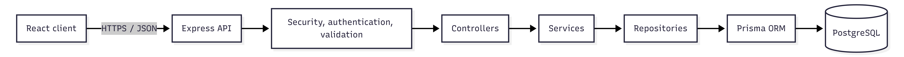
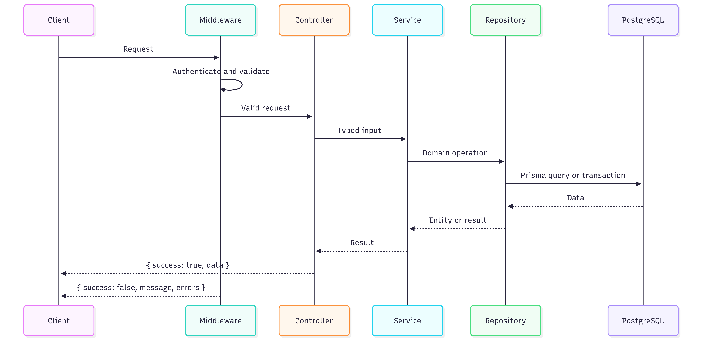

# Architecture

## Overview

The system is a two-application npm workspace: a React single-page application in `client/` and an Express API in `server/`. The API owns business rules and data access. The client renders data and sends validated user input; it never decides permissions, inventory availability, or prices.

## Server layering

Dependencies flow strictly downward. A lower layer must not import a higher layer.

| Layer            | Location                  | Responsibility                                                                    | Must not contain                  |
| ---------------- | ------------------------- | --------------------------------------------------------------------------------- | --------------------------------- |
| HTTP composition | `src/routes`              | Map HTTP verbs and paths to middleware and controllers.                           | Business rules or database calls. |
| Controllers      | `src/controllers`         | Translate validated HTTP input to service calls and write HTTP responses.         | Business rules or Prisma imports. |
| Services         | `src/services`            | Authorisation decisions, transactions, inventory rules, and domain orchestration. | Express request/response objects. |
| Repositories     | `src/repositories`        | Query and persist records through Prisma.                                         | HTTP details and business policy. |
| Infrastructure   | `src/config`, `src/utils` | Configure cross-cutting concerns and reusable technical helpers.                  | Domain-specific policy.           |

`src/middleware` runs at the HTTP boundary for authentication, role checks, input validation, rate limiting, not-found handling, and centralized error handling. `src/validators` contains Zod schemas. `src/types` contains shared TypeScript contracts and Express augmentations.

Prisma is accessed only from repositories. Multi-repository database work is initiated by a service and executed within a Prisma transaction supplied to those repositories. This is required for purchase and restock operations so inventory cannot be oversold under concurrent requests.

## Request and error flow

Controllers use one shared response helper for the success envelope. Services throw typed operational errors for expected cases (for example, a missing vehicle, insufficient stock, or forbidden action); centralized error middleware converts them into the failure envelope. Unknown errors are logged with a request correlation ID and returned as a generic 500 response without internal details.

## API conventions

- API routes are versioned at `/api` initially; a future breaking version uses `/api/v2` without changing existing clients.
- All payloads use JSON and all responses use the standard `success` envelope.
- Request identifiers are attached at the edge and logged for traceability.
- Authentication uses a bearer JWT. Role authorization is explicit middleware at routes that require it, with service-level authorization retained for sensitive domain actions.
- Pagination, filtering, and sorting use validated query parameters with bounded limits.

## Client architecture

| Area       | Location         | Responsibility                                             |
| ---------- | ---------------- | ---------------------------------------------------------- |
| Routes     | `src/routes`     | Route definitions and route guards.                        |
| Pages      | `src/pages`      | Screen-level composition.                                  |
| Components | `src/components` | Reusable presentational and feature UI.                    |
| Layouts    | `src/layouts`    | Shared page frames such as navigation and dashboard shell. |
| Context    | `src/context`    | App-wide state, initially authentication and theme.        |
| Hooks      | `src/hooks`      | Reusable UI and data-access behavior.                      |
| Services   | `src/services`   | Axios client configuration and API calls.                  |
| Utils      | `src/utils`      | Pure formatting and transformation helpers.                |
| Types      | `src/types`      | API and UI TypeScript contracts.                           |

Pages may compose components and invoke hooks. Components remain reusable and receive typed props; they do not make direct Axios calls. API services are the single client-side network boundary. React Hook Form and Zod validate UX input, but the server remains the authority for validation.

## Cross-cutting decisions

- Configuration is read once from environment variables, validated at startup, and exposed through `src/config`.
- Secrets never appear in source control. `.env.example` documents required non-secret variable names.
- Logging, error mapping, security headers, CORS, and rate limiting are configured centrally.
- Tests mirror production boundaries: unit tests for services and utilities, integration tests for repositories, and Supertest API tests for routes.
- Feature modules may be introduced inside the existing layer folders only when doing so preserves the same dependency rules.

## Phase 2 deliverables

This document and the source directory structure establish the architectural contract. Subsequent phases implement configuration, database schema, and feature modules within these boundaries.
