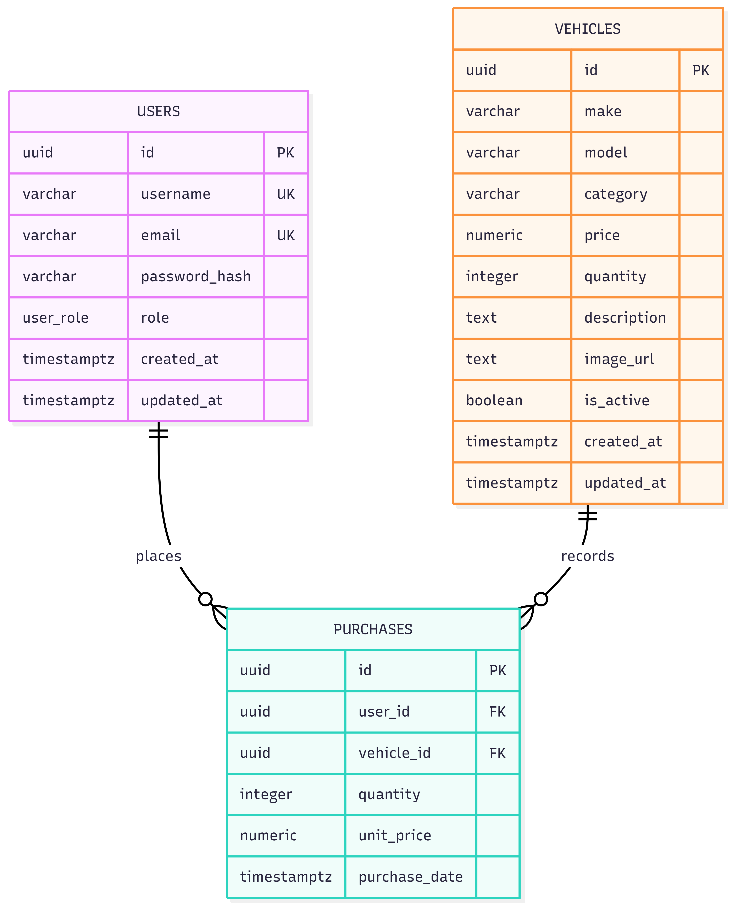

# Database Design

## Design goals

PostgreSQL is the system of record for identities, current vehicle inventory, and completed purchases. The schema is normalized to third normal form: user details are stored only in `users`, vehicle attributes and current stock only in `vehicles`, and each purchase only records the relationship and immutable purchase facts.

All identifiers are UUID primary keys generated by the database/ORM. Time is stored as `TIMESTAMPTZ` in UTC. Money uses `NUMERIC(12,2)`, never binary floating point.

## Entity relationship diagram

## Tables

### `users`

| Column          | Type             | Rules                                                                            |
| --------------- | ---------------- | -------------------------------------------------------------------------------- |
| `id`            | `UUID`           | Primary key; generated UUID.                                                     |
| `username`      | `VARCHAR(50)`    | Required; unique; case-insensitive uniqueness through a normalized unique index. |
| `email`         | `VARCHAR(254)`   | Required; unique; case-insensitive uniqueness through a normalized unique index. |
| `password_hash` | `VARCHAR(255)`   | Required bcrypt hash only; plaintext is never persisted.                         |
| `role`          | `user_role` enum | Required; defaults to `USER`; valid values are `USER` and `ADMIN`.               |
| `created_at`    | `TIMESTAMPTZ`    | Required; defaults to current UTC time.                                          |
| `updated_at`    | `TIMESTAMPTZ`    | Required; updated on every mutation.                                             |

The application normalizes email and username (trim and lowercase) before persistence. The unique indexes protect the rule even under concurrent registration attempts.

### `vehicles`

| Column        | Type            | Rules                                                                                                    |
| ------------- | --------------- | -------------------------------------------------------------------------------------------------------- |
| `id`          | `UUID`          | Primary key; generated UUID.                                                                             |
| `make`        | `VARCHAR(80)`   | Required.                                                                                                |
| `model`       | `VARCHAR(120)`  | Required.                                                                                                |
| `category`    | `VARCHAR(50)`   | Required; validated against the API’s supported category set.                                            |
| `price`       | `NUMERIC(12,2)` | Required; must be zero or greater.                                                                       |
| `quantity`    | `INTEGER`       | Required; defaults to zero; must be zero or greater.                                                     |
| `description` | `TEXT`          | Optional.                                                                                                |
| `image_url`   | `TEXT`          | Optional; validated URL at the API boundary.                                                             |
| `is_active`   | `BOOLEAN`       | Required; defaults to true. Archived vehicles are excluded from public listings and cannot be purchased. |
| `created_at`  | `TIMESTAMPTZ`   | Required; defaults to current UTC time.                                                                  |
| `updated_at`  | `TIMESTAMPTZ`   | Required; updated on every mutation.                                                                     |

`is_active` implements the delete endpoint as archival instead of physical deletion. This preserves purchase history and avoids breaking foreign-key references. An administrator can no longer sell an archived vehicle; a future restore operation can reactivate it without data reconstruction.

### `purchases`

| Column          | Type            | Rules                                                                         |
| --------------- | --------------- | ----------------------------------------------------------------------------- |
| `id`            | `UUID`          | Primary key; generated UUID.                                                  |
| `user_id`       | `UUID`          | Required foreign key to `users.id`; deletion is restricted.                   |
| `vehicle_id`    | `UUID`          | Required foreign key to `vehicles.id`; deletion is restricted.                |
| `quantity`      | `INTEGER`       | Required; must be greater than zero.                                          |
| `unit_price`    | `NUMERIC(12,2)` | Required; must be zero or greater; immutable price captured at purchase time. |
| `purchase_date` | `TIMESTAMPTZ`   | Required; defaults to current UTC time.                                       |

`unit_price` is intentionally stored with each purchase. It records the transaction price even when the vehicle’s current catalog price changes later; it is a fact of the purchase, not duplicated vehicle state.

## Keys, constraints, and indexes

| Object                                          | Kind                                                  | Purpose                                         |
| ----------------------------------------------- | ----------------------------------------------------- | ----------------------------------------------- |
| `users_pkey`, `vehicles_pkey`, `purchases_pkey` | Primary keys                                          | Entity identity and efficient joins.            |
| `users_username_normalized_key`                 | Unique expression index on `LOWER(username)`          | Prevents usernames differing only by case.      |
| `users_email_normalized_key`                    | Unique expression index on `LOWER(email)`             | Prevents emails differing only by case.         |
| `purchases_user_id_fkey`                        | Foreign key                                           | Preserves purchaser history.                    |
| `purchases_vehicle_id_fkey`                     | Foreign key                                           | Preserves vehicle purchase history.             |
| `vehicles_price_check`                          | Check                                                 | Enforces nonnegative price.                     |
| `vehicles_quantity_check`                       | Check                                                 | Enforces nonnegative inventory.                 |
| `purchases_quantity_check`                      | Check                                                 | Prevents zero or negative purchases.            |
| `purchases_unit_price_check`                    | Check                                                 | Prevents negative transaction prices.           |
| `vehicles_browse_idx`                           | Composite index on `(is_active, created_at DESC)`     | Supports newest public inventory listing.       |
| `vehicles_make_model_idx`                       | Composite index on `(make, model)`                    | Supports exact and prefix make/model filtering. |
| `vehicles_category_price_idx`                   | Composite index on `(category, price)`                | Supports category and price-range filtering.    |
| `purchases_user_date_idx`                       | Composite index on `(user_id, purchase_date DESC)`    | Supports a user’s purchase history.             |
| `purchases_vehicle_date_idx`                    | Composite index on `(vehicle_id, purchase_date DESC)` | Supports sales history per vehicle.             |

The Phase 4 Prisma migration implements the normalized expression indexes. Prisma queries normalize email and username before lookup, while PostgreSQL preserves case-insensitive uniqueness even if a database is accessed outside the API.

## Transaction rules

Purchasing inventory is a single database transaction:

1. Lock or atomically update the active vehicle only when `quantity >= requestedQuantity`.
2. Decrement `vehicles.quantity` by the requested amount.
3. Insert the purchase record with the vehicle’s current price as `unit_price`.
4. Commit both changes together; otherwise roll back all changes.

The conditional inventory mutation is the concurrency guard. A request that cannot decrement stock affects zero rows and becomes an `INSUFFICIENT_STOCK` domain error. No purchase row is written in that case.

Restocking is also transactional and increments quantity only by a validated positive amount. Administrative edits do not alter historic `purchases.unit_price`.

## Data retention and deletion

- A user with purchase history cannot be physically deleted because purchases are a business record.
- Deleting a vehicle through the API archives it (`is_active = false`); its row and purchase history remain intact.
- Administrative role changes and vehicle changes update `updated_at`.
- Backup, recovery, and retention policies are operational concerns documented in the deployment phase.

## Migration policy

All schema changes are created as reviewed Prisma migrations and committed to source control. Production deployments run migrations before application rollout. Direct manual DDL against production is prohibited except during an approved incident response.
